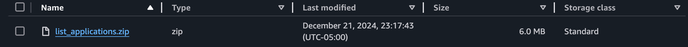
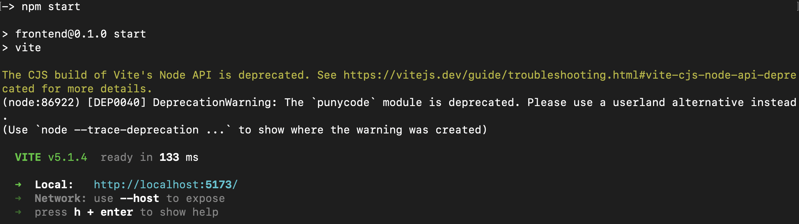
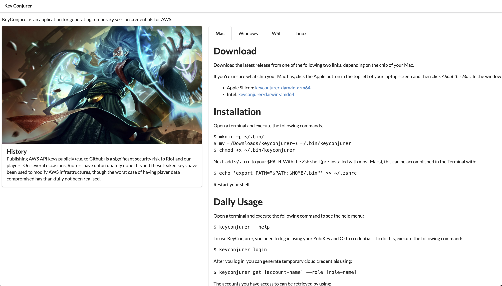

# User Startup Documentation

## Context
The build documentation is fairly sparce and contributors could benifit from having a more defined step-by-step explination of how to build, configure, and utilize the KeyConjurer tool. 

## Requirements

- S3 bucket
    - Permissible permissions for accessing the bucket
- VPC access
- go version 1.20+
- node version 16.17.0+
- Access to org Open ID Connect configuration data

## Initial Setup

First we must pull the code from the KeyConjurer repository and to do this run the following command in your terminal of choice:
```bash
git clone https://github.com/RiotGames/key-conjurer.git
```

This will download the latest version of KeyConjurer to the current working directory. Next we will go into the directory of KeyConjurer and begin setup.

```bash
cd key-conjurer
```

Here is where you have two options. KeyConjurer requires a few environment variables to be configured. You can either configure them directly through your terminal or you can create a `.env` file.

```bash
nano config.env

# In the config.env file add the following lines
export RELEASE="{PLACEHOLDER}"
export CLIENT_ID="{PLACEHOLDER}"
export OIDC_DOMAIN="{PLACEHOLDER}"
export SERVER_ADDRESS="{PLACEHOLDER}"
export S3_FRONTEND_BUCKET_NAME="{PLACEHOLDER}"
export S3_TF_BUCKET_NAME="{PLACEHOLDER}"
```

The environment variables each determine a specific and important piece of information required for KeyConjurer to function correctly. These values are consumed during the build process and embedded in the KeyConjurer executable. 

#### Required for the building of the main KeyConjurer GO binary.
- `CLIENT_ID`: This will be the client ID used for your Open ID Connect linked application. This is required.
- `OIDC_DOMAIN`: This will be the domain URL for your Open ID Connect application. This could look something like `keyconjurer.us.auth0.com`.
- `SERVER_ADDRESS`: Address of the target server that will be queried to get account data.

#### Optional flags
- `RELEASE`: By default KeyConjurer runs in `dev` mode. If you want to run it in dev mode you can either specify dev mode or remove this line and let the build process run with the default.
    - Depending on how you configure this the name and path of the S3 buckets will be formatted differently. Please take note of this
- `VERSION`: Default gets the short version of the current commit hash. Optionally customizable in the environment file.
- `TIMESTAMP`: Default to the value of the current time (to the nearest minute) following the ISO 8601 format. Optionally customizable in the environment file.

#### Used in the upload process
- `S3_FRONTEND_BUCKET_NAME`: The name of the S3 bucket that we will upload front-end and built binary files to during the build process. There are 2 main upload modes in the build process that will interact with this S3 bucket.
    - `cli_upload`: The CLI upload will upload only the finalized binaries that are produced after the build process is complete.
    - `frontend_upload`: The front-end upload will everything in the newly made `frontend/dist` directory which are files pertaining to the front-end of KeyConjurer. This will include site assets and an `index.html` file mainly.


- `S3_TF_BUCKET_NAME`: This bucket will be used to upload API build targets to.
    - `api_upload`: This will upload the API build targets.



Once you have configured your environment file you will need to run the following command to initialize them in your terminal session:
```bash
source {filename}.env
# Example.
source dev.env
```
> This step will not be required if you initialized the environment variables directly in your shell.

The next step is to run the build process using the premade `Makefile`. For this we can run the following command in the main `key-conjurer` directory:
```bash
# Normal build
make

# Cleans the build process artifacts and rebuilds
make clean && make

# Upload options
make cli_upload
make api_upload
make frontend_upload

# Does all 3
make upload
```

# CLI Installation

## Linux

Open a terminal and execute the following commands.
```bash
mkdir -p ~/.bin/
mv ~/Downloads/keyconjurer-* ~/.bin/keyconjurer
chmod +x ~/.bin/keyconjurer
```

Next, add `~/.bin` to your `$PATH`. With Bash, this can be accomplished in the Terminal with:
```bash
echo "export PATH="$PATH:$HOME/.bin"' >> ~/.bashrc
```

Restart your shell.

## Windows x64

Navigate to the `keyconjurer-windows.exe` in your windows terminal of choice and run as usual.
```bash
./keyconjurer-windows.exe
```

## MacOS
Open a terminal and execute the following commands.

```bash
mkdir -p ~/.bin/
mv ~/Downloads/keyconjurer-* ~/.bin/keyconjurer
chmod +x ~/.bin/keyconjurer
```
Next, add `~/.bin` to your `$PATH`. With the Zsh shell (pre-installed with most Macs), this can be accomplished in the Terminal with:
```bash
echo 'export PATH="$PATH:$HOME/.bin"' >> ~/.zshrc
```
Restart your shell.

> Please follow the instructions to add an exception to your Mac security policy in this [Apple support article][apple-support-article]. This is a known bug. We do not have the facility to sign Mac binaries, so the binary we ship is unsigned and Mac will, by default, try to prevent you from running it. 
>apple-support-article: https://support.apple.com/guide/mac-help/open-a-mac-app-from-an-unidentified-developer-mh40616/mac

# Daily Usage

Open a terminal and execute the following command to see the help menu:
```bash
keyconjurer --help
```

To use KeyConjurer, you need to log in using your YubiKey and Okta credentials. To do this, execute the following command:
```bash
keyconjurer login
```

After you log in, you can generate temporary cloud credentials using:
```bash
keyconjurer get [account-name] --role [role-name]
```

The accounts you have access to can be retrieved by using:
```bash
keyconjurer accounts
```

The roles you have access to can be retrieved by using:
```bash
keyconjurer roles [account-name]
```

KeyConjurer will function anywhere you have access to Okta. **You do not need to be on a specific VPN**. You may be required to have access to your YubiKey to access KeyConjurer.

# Web UI

At this point you also have the option of using the web user interface. Once built and uploaded there will be a directory on your system with the path of `frontend/dist` and inside of that there is an `index.html` along with a directory containing all of the assets for the site. You can run this site manually by using:
```bash
npm start
```


